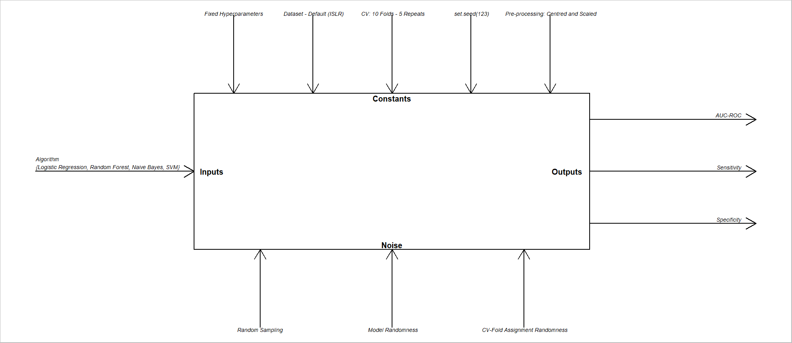

---
title: 'STAT2003: Assignment 1'
author: "Samantha Clements and Kafula Chewe"
date: "`r Sys.Date()`"
output:
  html_document: default
  pdf_document: default
---

```{r setup, include=FALSE}
knitr::opts_chunk$set(echo = TRUE)
```


```{r Install Packages, include=FALSE}
# install.packages("ISLR", dependencies = TRUE)
# install.packages("e1071", dependencies = TRUE)
# install.packages("randomForest", dependencies = TRUE)
# install.packages("caret", dependencies = TRUE)
# install.packages("tidyr", dependencies = TRUE)
#install.packages("car", dependencies = TRUE)
#install.packages("emmeans", dependencies = TRUE)

```


```{r Library, include=FALSE}
library(ISLR)
library(e1071)
library(randomForest)
library(caret)
library(tidyr)
library(car)
library(emmeans)

```
# QUESTION 1: Machine Learning Algorithms Comparison

## Experimental Design
A randomised block design (RBD) experiment is conducted to compare four machine learning algorithms for predicting credit card default using the Default dataset from the ISLR package (James et al. 2013). The experimental factor is algorithm type, with four levels: Logistic Regression (LR), Random Forest (RF), Naive Bayes (NB), and Support Vector Machine (SVM), as illustrated in the DOE Diagram (Figure 1).

The primary response is AUC-ROC. The Default dataset reveals a large class-imbalance leading to misleading overall accuracy. Models predicting non-defaulters for all observations achieve 97% accuracy yet have no discriminatory value. AUC-ROC measures each model's ability to distinguish defaulters from non-defaulters, where higher values indicate better discrimination, and is robust to class imbalance, making it the most appropriate metric (James et al. 2013).

The experiment is subject to three principles of experimental design (Montgomery 2020). Randomisation is conducted through random observation assignment to cross-validation (CV) folds with set.seed(123). Replication is achieved via repeated 10-fold CV with 5 repeats, producing 50 resamples, each serving as an experimental unit. Blocking treats each resample as a block; all algorithms are evaluated under identical splits, controlling fold-to-fold variation . Residual diagnostics are conducted prior to formal RBD ANOVA interpretation.

(197 words)

```{r Data Obtain and Inspect, echo = FALSE}
set.seed(123)
#Obtaining and inspecting the data
data(Default)
Default$default <- factor(Default$default, levels = c("No", "Yes"))
head(Default)

table(Default$default)

```

>>>>>>> a04943a732f52b70d23efbb765f19d06209d7726
```{r DOE Diagram, echo = FALSE, fig.cap="Figure 1: DOE diagram for Default Experiment" }

```

# Machine Learning Algorithms Comparison

## QUESTION 2: Experimental Design

A randomized block ANOVA was performed with algorithm as the treatment factor and resamples as the block factor. The results results that there was a statistical difference in the ROC means across algorithms at a the 5% significance level (p < 0.001), which means not all algorithms performed equally. Turkey HSD pairwise comparisons showed that Logistic Regression significantly outperformed Random Forrest and SVM (p < 0.001) but that it was not significantly different from Naive Bayes (p = 0.248). This suggests that Logistic Regression are statistically comparable in terms of performance. All other pairwise comparisons were significant at 5% level.

The estimated marginals means further justify this as they show that Logistic Regression had the highest ROC mean (0.949) and Naive Bayes had quite similar result (0.942) while Random Forrest and SVM performed worse, 0.896 and 0.926 respectively.

Assumption checks shows that normality of residuals was satisfied; however, homogeneity of variance was violated as seen in the Bartlett and Levene tests. Inspite of this, ANOVA is known to be relatively robust to these violations in cases where there is large number of replications. To support these findings, a non-parametric Friedman test was also conducted which confirmed a significant difference between algorithms (p < 0.001) which helped justify the conclusions drawn from ANOVA.

Overall, the results suggest that Logistic Regression and Naive Bayes as the best performing algorithms while Random forrest and SVM perform less effectively under this experimental design. 

(239 words)


```{r}
set.seed(123)
ctrl <- trainControl(method = "repeatedcv",
                     number = 10,
                     repeats = 5,          
                     summaryFunction = twoClassSummary,
                     classProbs = TRUE,
                     savePredictions = TRUE)
```

```{r Model Training, echo = FALSE}
#Training the models
set.seed(123)
PP <- c("center", "scale")

model_lr  <- train(default ~ ., data = Default, method = "glm",
                   family = "binomial", trControl = ctrl, metric = "ROC", preProcess = PP
                   )

model_rf  <- train(default ~ ., data = Default, method = "rf",  
                   trControl = ctrl, metric = "ROC",
                   tuneLength = 3, preProcess = PP)  

# Non-default hyperparameter, now kernel
model_nb  <- train(default ~ ., data = Default, method = "nb",
                   trControl = ctrl, metric = "ROC", 
                   tuneGrid  = data.frame(fL = 0, usekernel = TRUE, adjust = 1), preProcess = PP)


# non-default hyperparameter,
model_svm <- train(default ~ ., data = Default, method = "svmLinear2",
                   trControl = ctrl, preProcess = PP,
                   tuneLength = 3, metric = "ROC")
```

```{r Models Listed, include = FALSE}
#Creating a list of all four models
models <- list(LogisticRegression = model_lr,
               RandomForest = model_rf,
               NaiveBayes = model_nb,
               SVM = model_svm)
```

```{r Resampling Summary, echo = FALSE}
#Summary of resampling results
res <- resamples(models)

summary(res)
View(res$values)
```


```{r ROC Plot, echo = FALSE}
#Creates resamples that compares ROC across 30 resamples 
bwplot(res, metric = "ROC",
       main = "ROC AUC across 50 resamples (5×10 repeated CV)")
```


```{r}

res_df <- as.data.frame(res)
# head(res_df)

res_long <- pivot_longer(res_df,
                         cols = -Resample,
                         names_to = "Model", values_to = "ROC")


```

```{r}
res_long |>
  ggplot() +
  aes(x = ROC, y = Model) +
  geom_boxplot() +
  geom_point(aes(colour = Resample), size = 0.6, show.legend = FALSE) +
  labs(y     = "Models",
       x     = "AUC-ROC",
       title = "Figure 2: AUC-ROC across 50 resamples (5×10 repeated CV)") +
  theme_bw()
```


```{r Residual Diagnostic Plots}
library(car)

res_aov <- aov(ROC ~ Model + Resample, data = res_long)

# visual checks
plot(res_aov) 
#head(res_aov)

# normality test on residuals
shapiro.test(residuals(res_aov))

# homogeneity of variance test
bartlett.test(ROC ~ Model, data = res_aov$model)

leveneTest(ROC ~ Model, data = res_long)

# : p > 0.05, do not reject H0, normality is satisfied
# Bartlett: p < 0.05, reject H0, equal variance is not satisfied

```


```{r}
hist(residuals(res_aov))

```


```{r}

# log transform, H0 = equal medians / equal geometric means

y <- log(res_long$ROC)

res_log_aov <- aov(y ~ Model + Resample, data = res_long)


plot(res_log_aov)


shapiro.test(residuals(res_log_aov))
bartlett.test(y ~ Model, data = res_log_aov$model)

leveneTest(y ~ Model, data = res_long)

hist(residuals(res_log_aov))

# The log transformation makes the model worse. Proceed with initial model

```


```{r}
anova(res_aov)

# p < 0.001 indicates significant difference among algorithms. 
```


```{r}
friedman.test(ROC ~ Model | Resample, data = res_long)
```


```{r}
tukey_res <- TukeyHSD(res_aov, which = "Model")
tukey_res
```

```{r}
library(emmeans)
emmeans(res_aov, ~ Model)
```


##QUESTION 3: Algorithm Recommendation

Based on the experimental results, Logistic Regression is recommended for predicting credit card default. It had the highest point estimate ROC and showed consistency across resamples (blocks), demonstrating strong discrimination and stability. Though Naive Bayes was not significantly worse, Logistic Regression also provided a much higher specificity making it more effective for identifying default cases.

A limitation of this recommendation is that it is based on a singular dataset and the chosen resampling design, therefore, the results may differ when presented with new data.
(84 words)

## References

Kleijnen, Jack P. C. 2008. *Design and Analysis of Simulation Experiments*. 1st ed. New York: Springer-Verlag.

James, Gareth, Daniela Witten, Trevor Hastie, and Robert Tibshirani. 2013. *An Introduction to Statistical Learning*. Vol. 112. New York: Springer.

Montgomery, Douglas C. 2020. *Design and Analysis of Experiments*. 1st ed. Hoboken, NJ: Wiley.


